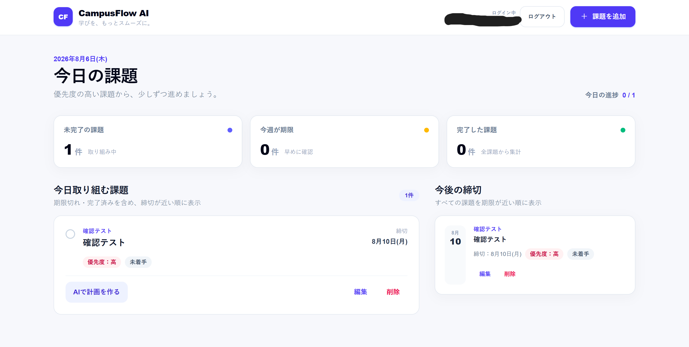
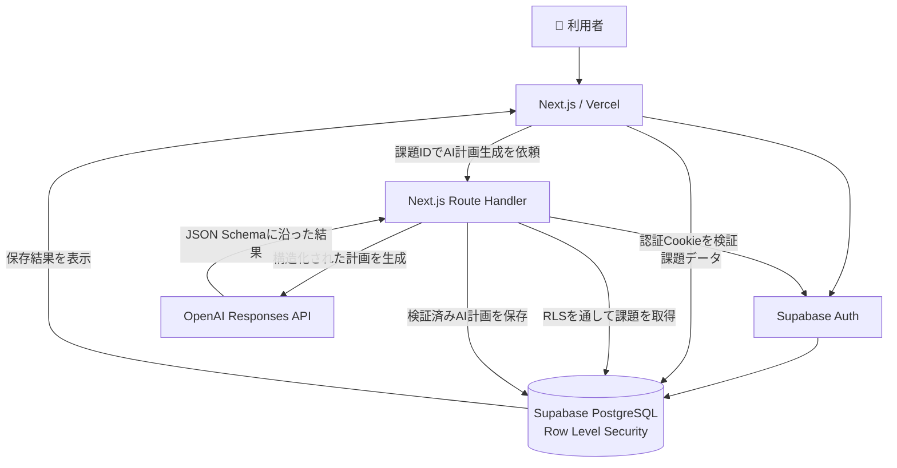

# 🎓 CampusFlow AI

> **大学の課題管理を、もっとシンプルに。**
>
> 課題を一元管理し、AIが提出までの作業計画を提案する大学生向けWebアプリです。

<p align="center">
  <a href="https://campusflow-ai-snowy.vercel.app/"><strong>🚀 CampusFlow AIを使ってみる</strong></a>
  &nbsp;&nbsp;•&nbsp;&nbsp;
  <a href="https://github.com/Fume829/campusflow-ai"><strong>📦 GitHub Repository</strong></a>
</p>

---

## ✨ CampusFlow AIとは

大学では、レポート・演習・試験準備など、複数の課題を同時に管理する必要があります。

締切は分かっていても、

- 何から始めればいいか分からない
- 大きな課題を後回しにしてしまう
- 毎週同じ課題を登録するのが面倒

といったことがあります。

**CampusFlow AI**は、課題の登録・進捗管理に加えて、AIによる作業分解や毎週課題の自動生成を行うことで、**「課題を把握する」だけでなく「次に何をすればいいか分かる」状態を作る**ことを目指したWebアプリです。

---

## 💡 開発背景

大学の課題を複数のツールやメモに分けて管理する手間を減らしたいと考えたことが、開発のきっかけです。

単に課題名と締切を記録するだけではなく、次に行う作業まで明確になれば、実際の行動へ移しやすくなると考えました。

そこで、OpenAI APIを利用して大きな課題を具体的な作業へ分解する機能を実装しました。

また、授業では「毎週○曜日までに提出」といった課題も多いため、毎週課題を一度登録すると、締切後に次週分を自動生成できる仕組みも追加しています。

---

## 🚀 主な機能

### 📚 課題管理

- 課題の追加・編集・削除
- 「未着手」「進行中」「完了」の状態管理
- 優先度の設定
- 締切日時の管理（日本時間）
- 締切が近い順での課題表示
- 今日取り組む課題の一覧表示

### 🔁 毎週課題

- 課題登録時に「毎週登録する」を選択可能
- 毎週課題用のテンプレートをSupabaseに保存
- 現在の課題の締切日時を過ぎると次週分を自動生成
- 同じテンプレート・締切日の課題が重複生成されないようDB側で制御

### 🤖 AI計画

- AIによる課題の作業分解
- 作業手順ごとの推定時間を生成
- 各手順に取り組む際のヒントを生成
- AI計画の保存・再表示・再生成

### 📊 ダッシュボード

- 未完了課題数
- 今週が期限の課題数
- 完了課題数
- 今日の進捗
- 今後の締切一覧

### 🔐 アカウント

- メールアドレス・パスワードによる新規登録
- ログイン・ログアウト
- ユーザーごとの課題データ管理
- Supabase RLSによるデータ分離

### 📱 UI

- PC / スマートフォン対応
- レスポンシブデザイン
- キーボード操作・アクセシビリティへの配慮

---

## 🖼️ スクリーンショット

### ダッシュボード

課題の進捗・期限・優先度を一覧で確認できます。

課題の追加・編集・削除・完了状態の切り替えや、AIによる作業計画の生成ができます。



---

## 🛠️ 使用技術

| 分類 | 技術 |
| --- | --- |
| Frontend | Next.js 16.2.12 / React 19.2.4 / TypeScript 5 / Tailwind CSS 4 |
| Backend | Next.js Route Handler |
| Database | Supabase PostgreSQL |
| Authentication | Supabase Auth |
| Security | Supabase Row Level Security |
| AI | OpenAI API / Responses API / Structured Outputs |
| Infrastructure | Vercel |
| Development | Codex |
| Version Control | Git / GitHub |

### 主なライブラリ

- `@supabase/supabase-js` 2.112.0
- `@supabase/ssr` 0.12.4
- OpenAI Node.js SDK 7.4.0

※ バージョンは`package.json`で確認できる技術にのみ記載しています。

---

## 🏗️ システム構成



---

## 🤖 AI計画生成の流れ

1. 利用者が課題カードから「AIで計画を作る」を実行
2. 課題IDをNext.jsのRoute Handlerへ送信
3. サーバー側でSupabase Authの認証状態を検証
4. RLSを通してログインユーザー本人の課題を取得
5. OpenAI Responses APIへ課題情報を送信
6. 作業手順・推定時間・ヒントを含む構造化された計画を生成
7. JSON Schemaとアプリ側の実行時型検証で結果を確認
8. 検証済みのAI計画のみSupabaseへ保存
9. 保存結果を画面へ反映してモーダルに表示

---

## 🔁 毎週課題生成の仕組み

毎週発生する課題は、通常の課題データとは別にテンプレート情報を保持します。

```text
毎週課題を登録
      ↓
assignment_templates
へテンプレートを保存
      ↓
最初の課題をassignmentsへ保存
      ↓
締切日時を過ぎる
      ↓
generate_recurring_assignments()
      ↓
次週の課題を生成
```

次週分は現在の課題の締切を過ぎるまで生成しません。

また、

```text
template_id + due_date
```

に一意制約を設けることで、画面の再読み込みなどによって同じ週の課題が重複生成されることを防いでいます。

---

## 🔐 セキュリティ上の工夫

- OpenAI APIキーはサーバー側の環境変数のみで管理
- APIキーをブラウザへ公開しない構成
- OpenAI SDKをサーバー専用モジュールから利用
- Supabase RLSによってユーザーごとの課題データを分離
- `service_role`キーを使用しない設計
- `user_id`をブラウザ側から指定せず、認証情報とRLSでアクセスを制御
- AI出力をJSON Schemaと実行時型検証の両方でチェック
- 検証済みのAI出力のみデータベースへ保存
- 同じ課題のAI計画を30秒以内に再生成できないようサーバー側で制限
- `.env.local`を`.gitignore`の対象として管理
- `dangerouslySetInnerHTML`を使用せず、AI出力をReactの通常テキストとして描画
- 毎週課題の重複生成をデータベースの一意制約で防止

---

## 📁 ディレクトリ構成

```text
campusflow-ai/
│
├─ app/
│  ├─ api/
│  │  └─ assignments/
│  │     └─ [id]/
│  │        └─ ai-plan/
│  │           └─ route.ts
│  ├─ auth/
│  │  └─ callback/
│  │     └─ route.ts
│  ├─ components/
│  │  ├─ auth/
│  │  ├─ ai-plan-modal.tsx
│  │  ├─ assignment-card.tsx
│  │  ├─ assignment-form-modal.tsx
│  │  └─ dashboard.tsx
│  ├─ lib/
│  │  └─ assignments.ts
│  ├─ login/
│  │  └─ page.tsx
│  ├─ signup/
│  │  └─ page.tsx
│  ├─ types/
│  │  └─ assignment.ts
│  ├─ layout.tsx
│  └─ page.tsx
│
├─ lib/
│  ├─ supabase/
│  │  ├─ client.ts
│  │  ├─ database.types.ts
│  │  ├─ server.ts
│  │  └─ proxy.ts
│  └─ openai.ts
│
├─ public/
├─ supabase/
│  ├─ migrations/
│  └─ config.toml
├─ proxy.ts
├─ package.json
└─ README.md
```

---

## 💻 ローカル環境での起動方法

### 1. リポジトリを取得

```bash
git clone https://github.com/Fume829/campusflow-ai.git
cd campusflow-ai
npm install
```

### 2. 環境変数を設定

プロジェクト直下に`.env.local`を作成します。

```dotenv
NEXT_PUBLIC_SUPABASE_URL=
NEXT_PUBLIC_SUPABASE_PUBLISHABLE_KEY=
OPENAI_API_KEY=
```

値はSupabaseとOpenAIの各管理画面から取得してください。

Supabase側では、メールアドレス・パスワード認証とデータベースの設定が必要です。

データベース変更は`supabase/migrations/`で管理しています。

### 3. 開発サーバーを起動

```bash
npm run dev
```

起動後、`http://localhost:3000`へアクセスします。

---

## 🧪 開発用コマンド

| コマンド | 内容 |
| --- | --- |
| `npm run dev` | 開発サーバーを起動 |
| `npm run build` | 本番用にビルド |
| `npm run start` | ビルド済みの本番サーバーを起動 |
| `npm run lint` | ESLintでコードを検査 |
| `npx supabase migration list` | Supabase migrationの状態を確認 |
| `npx supabase db push` | migrationをリモートDBへ反映 |

---

## 🧠 工夫した点

### Server ComponentとClient Componentの役割分担

トップページをServer Componentとして実装し、認証確認と課題の初期取得をサーバー側で行っています。

操作の多いDashboardはClient Componentとして実装し、サーバー側の安全性とブラウザ側の操作性を両立しています。

### AIへ直接データを送信しない設計

ブラウザからOpenAI APIへ直接課題情報を送るのではなく、課題IDだけをNext.jsのRoute Handlerへ送信します。

サーバー側で認証を確認した後、RLSを通してデータベースから本人の課題を取得しています。

### Structured Outputs + 実行時検証

OpenAIのStructured Outputsを利用するだけでなく、アプリ側でも生成結果を検証しています。

想定した形式を満たしたデータだけを保存することで、AIの出力をそのまま信用しない構成にしています。

### Supabase RLS

ユーザーIDによる絞り込みをフロントエンドだけに依存せず、データベース側のRLSでもアクセスを制御しています。

### 毎週課題の重複防止

毎週課題では、テンプレートIDと締切日の組み合わせに一意制約を設定しています。

これにより、ページを複数回読み込んだ場合でも同じ課題が重複して生成されないようにしています。

### 日時管理

締切はSupabaseの`due_at`（`timestamptz`）へ絶対時刻として保存し、入力・表示は`Asia/Tokyo`として扱っています。

移行期間中は`due_date`も併記しています。

### アクセシビリティ

モーダルのEscapeキー操作、背景クリック、フォーカス復帰、ボタンの`aria-label`など、キーボード操作にも配慮しています。

---

## 🌱 今後の改善

- [x] AIによる課題の作業分解
- [x] Supabase Authによるユーザー認証
- [x] ユーザーごとの課題管理
- [x] 毎週課題の登録
- [x] 締切後の次週課題自動生成
- [ ] 課題期限前のメール・プッシュ通知
- [ ] Googleカレンダーとの連携
- [ ] 科目ごとの絞り込み・検索
- [ ] AI計画の手順ごとの完了管理
- [ ] 自動テストの追加
- [ ] OpenAI APIの利用回数制限の強化

---

## 👨‍💻 Author

**Fume829**

大学で情報系分野を学びながら、AI・Webアプリケーション開発に取り組んでいます。

GitHub: [@Fume829](https://github.com/Fume829)

---

<p align="center">
  🎓 <strong>CampusFlow AI</strong><br>
  課題管理から、「次にやること」が分かる課題管理へ。
</p>
