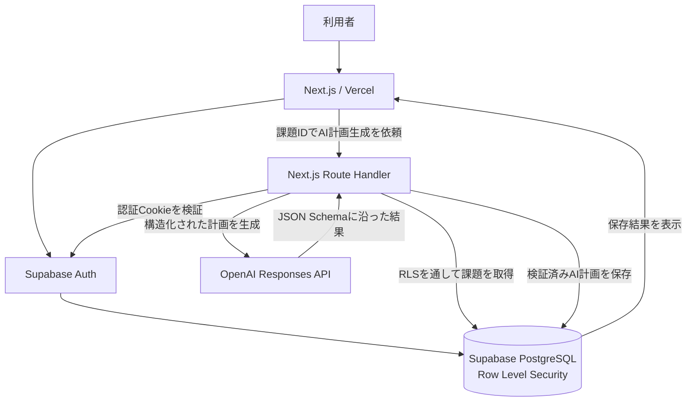

# CampusFlow AI

大学の課題を一元管理し、AIが提出までの作業計画を提案するWebアプリです。

- [公開アプリ](https://campusflow-ai-snowy.vercel.app/)
- [GitHubリポジトリ](https://github.com/Fume829/campusflow-ai)

## 概要

大学生は、複数の授業で出されるレポートや演習、試験準備を同時に管理する必要があります。締切を把握できていても、作業量が大きい課題では、何から着手すればよいか分からないことがあります。

CampusFlow AIは、課題の登録・進捗管理と、AIによる作業分解を一つのアプリで行えるようにしたWebアプリです。課題を登録すると、AIが提出までの具体的な作業手順、各手順の推定時間、取り組む際のヒントを提案します。

## 開発背景

大学の課題を複数のツールやメモに分けて管理する手間を減らしたいと考えたことが、開発のきっかけです。課題名と締切を記録するだけでなく、次に行う作業が明確になり、実際の行動へ移しやすい仕組みを目指しました。

AIは単なる文章生成ではなく、大きな課題を具体的な手順へ分解し、学生の行動計画を支援する機能として活用しています。

## 主な機能

- メールアドレスとパスワードによる新規登録・ログイン
- ログインユーザーごとの課題データ管理
- 課題の追加、編集、削除
- 「未着手」「進行中」「完了」の状態管理
- 優先度と締切日時の管理（日本時間）
- 締切が近い順での課題表示
- 未完了数、今週が期限の課題数、完了数の自動集計
- 今日取り組む課題の一覧表示
- AIによる課題の作業分解
- 作業手順ごとの推定時間と取り組みのヒントの生成
- AI計画の保存、再表示、再生成
- PCとスマートフォンに対応したレスポンシブデザイン

## スクリーンショット

### ダッシュボード

課題の進捗、期限、優先度を一覧で確認できます。課題の追加・編集・削除・完了状態の切り替えに対応しています。


## 使用技術

| 分類 | 技術 |
| --- | --- |
| フロントエンド | Next.js 16.2.12、React 19.2.4、TypeScript 5、Tailwind CSS 4 |
| バックエンド・データベース | Next.js Route Handler、Supabase PostgreSQL、Supabase Row Level Security、`@supabase/supabase-js` 2.112.0、`@supabase/ssr` 0.12.4 |
| 認証 | Supabase Auth |
| AI | OpenAI API、OpenAI Responses API、Structured Outputs、OpenAI Node.js SDK 7.4.0 |
| インフラ | Vercel |
| 開発支援 | Codex |
| コード管理 | GitHub、Git |

バージョンは、`package.json`で確認できる技術にのみ記載しています。

## システム構成



## AI計画生成の流れ

1. 利用者が課題カードからAI計画生成を実行します。
2. 課題IDだけをNext.jsのRoute Handlerへ送信します。
3. サーバー側でSupabase Authの認証状態を検証します。
4. SupabaseからRLSを通して、ログインしている本人の課題を取得します。
5. OpenAI Responses APIで、作業手順・推定時間・ヒントを含む構造化された計画を生成します。
6. JSON Schemaとアプリ側の実行時型検証で、生成結果を確認します。
7. 検証済みの計画だけをSupabaseへ保存します。
8. 保存した計画を課題データへ反映し、画面のモーダルに表示します。

## セキュリティ上の工夫

- OpenAI APIキーはサーバー側の環境変数だけで管理しています。
- APIキーをブラウザへ公開せず、OpenAI SDKをサーバー専用モジュールから利用しています。
- SupabaseのRLSによって、利用者ごとに課題データを分離しています。
- `service_role`キーは使用していません。
- 課題の`user_id`をブラウザから指定せず、認証情報とRLSへアクセス制御を任せています。
- AI出力をJSON Schemaと独自の実行時型検証で確認し、検証済みのデータだけを保存しています。
- 同じ課題のAI計画を30秒以内に再生成できないよう、サーバー側で制限しています。
- `.env.local`を`.gitignore`の対象にしています。
- AI出力はReactの通常のテキストとして描画し、`dangerouslySetInnerHTML`を使用していません。

## ディレクトリ構成

```text
app/
├─ api/
│  └─ assignments/[id]/ai-plan/route.ts
├─ auth/
│  └─ callback/route.ts
├─ components/
│  ├─ auth/
│  ├─ ai-plan-modal.tsx
│  ├─ assignment-card.tsx
│  └─ dashboard.tsx
├─ lib/
│  └─ assignments.ts
├─ login/
│  └─ page.tsx
├─ signup/
│  └─ page.tsx
├─ types/
│  └─ assignment.ts
├─ layout.tsx
└─ page.tsx
lib/
├─ supabase/
│  ├─ client.ts
│  ├─ server.ts
│  └─ proxy.ts
└─ openai.ts
public/
proxy.ts
```

## ローカル環境での起動方法

### 1. リポジトリを取得

```bash
git clone https://github.com/Fume829/campusflow-ai.git
cd campusflow-ai
npm install
```

### 2. 環境変数を設定

プロジェクト直下に`.env.local`を作成し、次の変数を設定します。値はSupabaseとOpenAIの各管理画面から取得してください。

```dotenv
NEXT_PUBLIC_SUPABASE_URL=
NEXT_PUBLIC_SUPABASE_PUBLISHABLE_KEY=
OPENAI_API_KEY=
```

Supabase側では、メールアドレス・パスワード認証の設定、`assignments`テーブル、ログインユーザーが自分の課題だけを操作できるRLSポリシーが必要です。

### 3. 開発サーバーを起動

```bash
npm run dev
```

起動後、[http://localhost:3000](http://localhost:3000)へアクセスします。

## 利用できるコマンド

| コマンド | 内容 |
| --- | --- |
| `npm run dev` | 開発サーバーを起動します。 |
| `npm run build` | 本番用にアプリをビルドします。 |
| `npm run start` | ビルド済みの本番サーバーを起動します。 |
| `npm run lint` | ESLintでコードを検査します。 |

## 工夫した点

- トップページをServer Componentとして実装し、認証確認と課題の初期取得をサーバー側で行いながら、DashboardをClient Componentとして操作性を確保しました。
- 認証CookieをNext.jsのProxyで更新し、サーバーとブラウザの認証状態を維持しています。
- 課題取得時に`user_id`をブラウザから渡さず、SupabaseのRLSへアクセス制御を任せています。
- AIへ課題内容をクライアントから直接送信せず、課題IDを受け取ったサーバーがデータベースから取得しています。
- OpenAIのStructured Outputsとアプリ独自の実行時型検証を組み合わせ、不正な形式のAI出力を保存しない設計にしています。
- 以前ブラウザのlocalStorageに保存していた課題を検証し、利用者の選択後にSupabaseへ移行する仕組みを実装しました。
- 締切はSupabaseの`due_at`（`timestamptz`）へ絶対時刻として保存し、入力・表示は常に`Asia/Tokyo`として扱っています。移行期間中は`due_date`も併記します。
- モーダルのEscapeキー操作、背景クリック、フォーカス復帰、ボタンの`aria-label`など、キーボード操作とアクセシビリティにも配慮しました。

## 今後の改善案

以下は未実装であり、今後の改善案です。

- 課題期限前のメール・プッシュ通知
- Googleカレンダーとの連携
- 科目ごとの絞り込み・検索
- AI計画の手順ごとの完了管理
- 自動テストの追加
- OpenAI APIの利用回数制限の強化

## 作者

- GitHub: [Fume829](https://github.com/Fume829)
